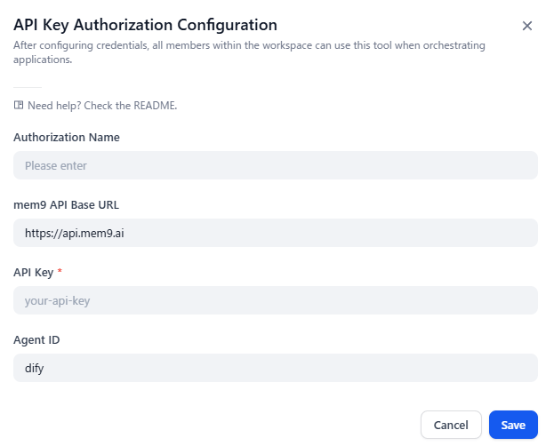
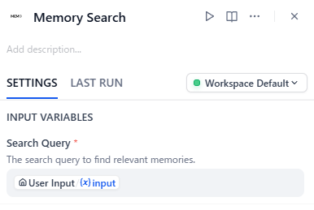
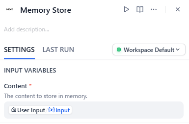

# mem9 – Long-term Memory for Dify

mem9 plugin gives your Dify agents and workflows persistent, long-term memory. It lets your AI remember facts, preferences, and prior context across conversations.

## Setup

Install the plugin in Dify, then go to **Tools > mem9 > Authorize** and fill in the following credentials:

| Credential | Required | Description |
|---|---|---|
| **Authorization Mode** | Yes | `Single space` (bind one mem9 space here) or `Multi-space` (configure API Key per workflow node). Defaults to `Single space`. |
| **API Base URL** | No | Defaults to `https://api.mem9.ai`. Change this only if you are using a self-hosted mem9 instance. |
| **API Key** | Conditional | Required in `Single space` mode. In `Multi-space` mode, leave empty — the field stays visible but its value is ignored. |
| **Agent ID** | No | Defaults to `dify`. Use a custom value to separate memory namespaces when multiple apps share the same mem9 space. |



If you don't have an API key, run this command.

```bash
curl -X POST https://api.mem9.ai/v1alpha1/mem9s
```

> **Upgrade note.** When upgrading from a version without the Authorization Mode selector, existing installs will see `Please Enter` on that field. Re-open the authorization page and select `Single space` once to keep your previous behavior; runtime stays on `Single space` until you save the change.

## Authorization Modes

mem9 supports two authorization layouts. Choose the mode that matches how you plan to use the plugin.

### Single space (default)

Bind one mem9 space to this plugin install. The API Key configured at authorization time is used for every tool call in every workflow.

- Use this when all your workflows share the same memory space.
- The `API Key` field on workflow nodes is ignored.

### Multi-space

Select `Multi-space` and leave the API Key field empty. Each workflow node must then provide its own API Key, so a single workflow can read from and write to multiple mem9 spaces.

- Use this for multi-tenant apps, per-team memory, or any case where one workflow needs to switch spaces.
- The `API Key` field on every Memory Search / Memory Store node becomes effectively required.
- The provider-level `API Key` field stays visible but is ignored in this mode.

**Recommended: bind workflow node API Keys to Dify environment variables** rather than pasting the key into each node:

```
# In your Dify workspace, define environment variables:
MEM9_API_KEY_TEAM_A = sk-...
MEM9_API_KEY_TEAM_B = sk-...

# In each workflow node, reference the variable:
Memory Search node → API Key: {{env.MEM9_API_KEY_TEAM_A}}
Memory Store node  → API Key: {{env.MEM9_API_KEY_TEAM_A}}
```

This keeps real keys out of the workflow JSON and lets you switch spaces by re-binding the variable, instead of editing every node. Pasting the key directly into a node is supported as a fallback but is not recommended.

> **Agent apps note.** Agent apps can also set a tool-level API Key on each tool, but the value is static for the whole app — multi-space is most useful in Workflow apps where different nodes can carry different keys.

## Tools

### Memory Search

Search for relevant memories based on a query.



### Memory Store

Store information into long-term memory. mem9 automatically extracts and reconciles key facts from the content you provide — you don't need to pre-process it.



## Recommended System Prompt

For Function Calling / Agent apps, paste the following snippet into your agent's system prompt (under **Instructions** in Dify Studio). It calibrates when the agent should call `memory_search` and `memory_store`, and how to phrase queries.

```
You have access to a long-term memory tool (mem9):

- memory_store: Save durable facts about the user, project, or team that
  should persist across conversations. Use it when the user states
  preferences, decisions, plans, or stable facts. Do NOT use it for
  transient context, greetings, one-off task instructions, or restating
  questions the user just asked.
- memory_search: Recall relevant facts before answering anything that
  depends on prior context. Use a short declarative query (e.g. "user's
  preferred language"), not a full question.

Calling rules:
1. Before answering anything that depends on prior context, call
   memory_search.
2. When the user shares a fact, preference, or decision, call
   memory_store with one fact per call.
3. If memory_search returns empty or includes a retry_hint, follow the
   hint and try again with a rephrased query before giving up.
4. memory_store is asynchronous — do not call memory_search for content
   you just stored in the same turn.
```

## Session ID (optional)

Session ID controls memory isolation. When set, searches and stores are scoped to that session.

**Recommended setup:** bind Session ID to Dify's built-in `sys.conversation_id` variable. This gives each conversation its own memory scope while still allowing cross-session recall when Session ID is left empty.

- **In Agent apps** — set Session ID to `{{sys.conversation_id}}` in the tool configuration.
- **In Workflow apps** — pass the `sys.conversation_id` variable to the Session ID field of the Memory Search / Memory Store nodes.

If you don't set a Session ID, memories are stored and searched globally within your mem9 space.
